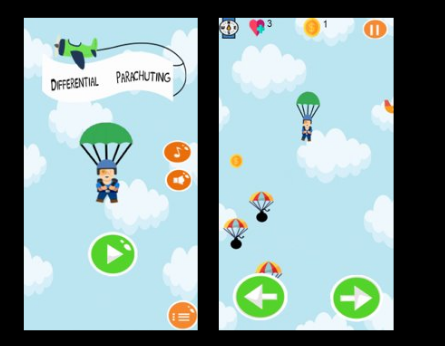
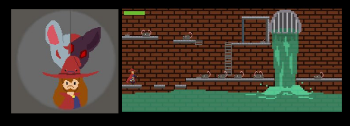

## Meu Portfólio

## Quem sou eu?

- Victória Arminda
- 17 anos
- Estudante de Programação de Jogos Digitais
- IFRN
- Futura acadêmica em Direito(UFRN).

"A imaginação é mais importante que a ciência, porque a ciência é limitada, ao passo que a imaginação abrange o mundo inteiro".
Albert Einstein

## Contatos
1. Email: vitoriaarminda11@gmail.com  
2. Instagram: victoriaarminda  
3. Facebook: Victória Arminda
4. Currículo Lattes: [Clique aqui](	http://lattes.cnpq.br/8863620791566898)

## Jogos
- Encontrei nos jogos digitais a oportunidade de imaginar e realizar...

**Jogo 1**: Differential Parachuting

- Se você é corajoso de verdade, que tal embarcar em uma verdadeira aventura? nada melhor do que um paraquedismo diferenciado!!
[Clique aqui](https://armindaa.github.io/JogoDeParaquedismo/)

**Jogo 2**: The Wizard
- Já imaginou se você fosse um mago e pudesse se transformar em vários animais? Além de combater com inimigos bem maiores que você? Quer encarar esse desafio? então [Clique aqui](https://ronaque.github.io/The%20Wizard/)

**Jogo 3**: 

**Jogo 4**:

**Jogo 5**: Que tal aprender um pouco sobre citologia?

## Participação em eventos e Cursos

-  Expotec do IFRN- Ceará-Mirim 2017
- International MasterClasses Hands On Particle Physics 2017
- Conferência: Dolmen- As diferentes áreas de atuação do Empreendedorismo em Jogos Digitais
- Curso em Lógica Informal, Argumentação e Pensamento Crítico I e II
- Performace para musical I
- Epogames 2017
- Secitex 2018

## Projetos de Pesquisas

- A importância da matemática na programação de jogos digitais;
- Som e letra: A relação entre o poema e a música em Lourival Açucena.

## Certificados 

